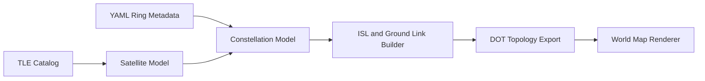
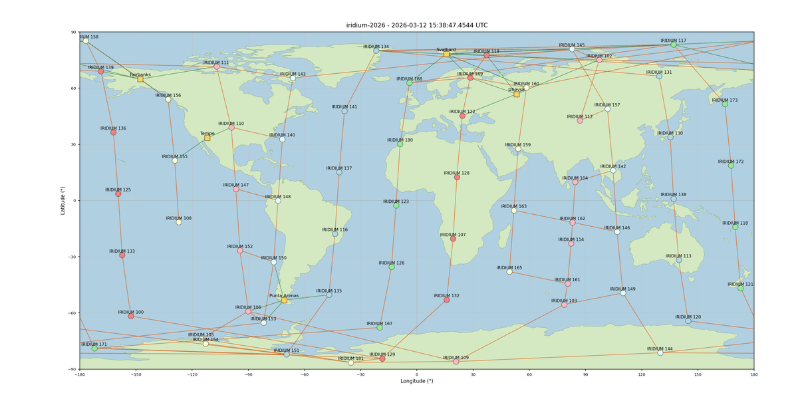

# OrbitShield Module

[](../../LICENSE)
[](../../README.md)

## Overview

OrbitShield is an ns-3 module to simulate satellite constellations, inter-satellite links (ISLs), and satellite-ground connectivity for LEO-style systems.

The module provides:
- Satellite nodes initialized from TLEs via SGP4 (through `perturb`)
- Constellation loading from TLE and YAML metadata files
- Ring-aware topology metadata and traversal helpers
- Ground station modeling
- Distance-based ISL and satellite-ground link construction
- Time-aware topology refresh
- DOT export and visualization tooling

## Table of Contents

- [OrbitShield Module](#orbitshield-module)
  - [Overview](#overview)
  - [Table of Contents](#table-of-contents)
  - [Quick Start](#quick-start)
  - [Architecture](#architecture)
  - [Current Implementation](#current-implementation)
    - [Models and Core Components](#models-and-core-components)
    - [Tests](#tests)
    - [Examples](#examples)
    - [Tools](#tools)
  - [Module Structure](#module-structure)
  - [Dependencies](#dependencies)
  - [Prerequisites](#prerequisites)
  - [Compatibility](#compatibility)
  - [Building](#building)
  - [Basic Usage](#basic-usage)
    - [Create One Satellite from TLE](#create-one-satellite-from-tle)
    - [Create Constellation from TLE File](#create-constellation-from-tle-file)
    - [Create Constellation from YAML Ring File](#create-constellation-from-yaml-ring-file)
    - [Build Links](#build-links)
    - [Dynamic Refresh](#dynamic-refresh)
  - [Ring Metadata Format (YAML)](#ring-metadata-format-yaml)
  - [Visualization Tooling](#visualization-tooling)
    - [ISL Visualizer (`orbitshield-isl-visualizer`)](#isl-visualizer-orbitshield-isl-visualizer)
    - [Render DOT on World Map](#render-dot-on-world-map)
    - [Generate Frames / GIF](#generate-frames--gif)
    - [Example Generated Visualization](#example-generated-visualization)
  - [Running Examples](#running-examples)
  - [API Reference](#api-reference)
  - [Testing](#testing)
  - [Coordinate System Notes](#coordinate-system-notes)
  - [Future Enhancements](#future-enhancements)
  - [Contributing](#contributing)
  - [Citation and Attribution](#citation-and-attribution)
  - [Release Notes](#release-notes)
  - [License](#license)
  - [Authors](#authors)

## Quick Start

From the ns-3 root:

```bash
./ns3 build
./ns3 run orbitshield-load-from-yaml

./ns3 run orbitshield-isl-visualizer -- \
  --ringFile=contrib/orbitshield/data/iridium-20260312.yaml \
  --islMaxRange=5000 \
  --groundMaxRange=3000 \
  --simTime=600 \
  --outputFile=out.dot

./contrib/orbitshield/tools/generate-constellation-image.sh --frames=10 --timeStep=60 --gifFile=iridium.gif --gifFps=10
```

## Architecture



## Current Implementation

### Models and Core Components
- `Satellite` (`Node`):
  - TLE-backed orbital propagation
  - Position in **ECEF** coordinates (`GetPosition`)
  - Velocity in **ECI/TEME** coordinates (`GetVelocity`)
  - Ground track latitude/longitude/altitude
- `GroundStation` (`Node`):
  - Name, latitude, longitude
  - Fixed-position mobility attachment when needed for link-distance evaluation
- `Constellation` (`Object`):
  - Load from TLE text files
  - Load from YAML ring metadata files (including optional auto-load of TLE file)
  - Ring APIs (`GetSatellitesInRing`, `GetNextRingSatellites`, `GetPreviousRingSatellites`, `GetRingOfSatellite`)
  - Ground station access (`GetGroundStations`)
  - ISL creation (`CreateIslLinks`) and satellite-ground link creation (`CreateGroundLinks`)
  - Cached current topology (`GetCurrentIsls`, `GetCurrentGroundLinks`)
  - Periodic topology refresh (`SetIslRefreshInterval`, `RefreshIslTopology`)
  - Graphviz DOT export for satellites, ground stations, and links
- `SatelliteMobilityModel`:
  - Binds ns-3 mobility interface to a `Satellite`
- `SatelliteNetDevice` and `SatelliteLink`:
  - Point-to-point style connectivity over dynamically evaluated links
- `IslPropagationDelayModel`:
  - Delay model based on distance between endpoint mobility models

### Tests
Implemented and built in the module test suite:
- `test-satellite.cc`
- `test-constellation.cc`
- `test-isl.cc`
- `test-orbitshield.cc`

Coverage includes:
- TLE-based satellite construction and propagation sanity
- Ground track outputs
- Ring/YAML loading and ring traversal helpers
- DOT export (including ground station nodes/edges)
- ISL and ground-link distance behavior
- Frame-consistency checks for ECEF position workflow
- Dynamic topology refresh behavior
- ISL channel/net-device basic send/receive behavior

### Examples
- `orbitshield-basic-example`
- `orbitshield-load-from-tle`
- `orbitshield-load-from-yaml`
- `orbitshield-dynamic-topology`

### Tools
- `orbitshield-isl-visualizer` (C++ executable)
- `render-isl-worldmap.py` (Python DOT-to-world-map renderer)
- `generate-constellation-image.sh` (end-to-end frame/image/GIF generation helper)

## Module Structure

```text
contrib/orbitshield/
|- model/
|  |- satellite.h
|  |- satellite.cc
|  |- ground-station.h
|  |- ground-station.cc
|  |- constellation.h
|  |- constellation.cc
|  |- satellite-link.h
|  |- satellite-link.cc
|  |- satellite-net-device.h
|  |- satellite-net-device.cc
|  |- satellite-mobility-model.h
|  |- satellite-mobility-model.cc
|  |- isl-propagation-delay-model.h
|  |- isl-propagation-delay-model.cc
|  |- orbitshield-utils.h
|  |- orbitshield-utils.cc
|  |- orbitshield-module.h
|- test/
|  |- test-satellite.cc
|  |- test-constellation.cc
|  |- test-isl.cc
|  |- test-orbitshield.cc
|- examples/
|  |- orbitshield-basic-example.cc
|  |- orbitshield-load-from-tle.cc
|  |- orbitshield-load-from-yaml.cc
|  |- orbitshield-dynamic-topology.cc
|- tools/
|  |- isl-visualizer.cc
|  |- render-isl-worldmap.py
|  |- generate-constellation-image.sh
|- data/
|  |- iridium-20260312.txt
|  |- iridium-20260312.yaml
|- CMakeLists.txt
`- README.md
```

## Dependencies

- `perturb` (SGP4 wrapper), fetched automatically by CMake (`FetchContent`)
- `yaml-cpp` for YAML constellation metadata parsing, fetched automatically by CMake (`FetchContent`)
- ns-3 modules linked by orbitshield:
  - `core`, `network`, `mobility`, `propagation`, `buildings`

## Prerequisites

- A working ns-3 build environment (compiler, CMake, Python)
- `graphviz` (`dot`) for DOT rendering
- Python 3 with `matplotlib` for world-map rendering

`yaml-cpp` and `perturb` are fetched automatically by CMake during configure/build.

Example install (Ubuntu/Debian):

```bash
sudo apt-get update
sudo apt-get install -y graphviz python3-matplotlib
```

## Compatibility

- Targeted for the ns-3 development tree in this repository.
- Designed for Linux-based development environments.
- If using a different ns-3 branch or toolchain, validate with a full build and test run.

## Building

From ns-3 root:

```bash
./ns3 build
```

## Basic Usage

### Create One Satellite from TLE

```cpp
#include "ns3/core-module.h"
#include "ns3/orbitshield-module.h"

using namespace ns3;

int main()
{
    std::string name = "ISS (ZARYA)";
    std::string tle1 = "1 25544U 98067A   22071.78032407  .00021395  00000-0  39008-3 0  9996";
    std::string tle2 = "2 25544  51.6424  94.0370 0004047 256.5103  89.8846 15.49386383330227";

    // IMPORTANT: perturb::Satellite::from_tle mutates its string arguments,
    // so use copies for epoch extraction.
    std::string tle1Epoch = tle1;
    std::string tle2Epoch = tle2;
    perturb::Satellite tmp = perturb::Satellite::from_tle(tle1Epoch, tle2Epoch);
    perturb::JulianDate simStart = tmp.epoch();

    Ptr<Satellite> sat = CreateObject<Satellite>(name, tle1, tle2, simStart);

    // ECEF position (meters)
    Vector3D ecef = sat->GetPosition();
    std::cout << sat->GetName() << " ECEF=" << ecef << std::endl;

    return 0;
}
```

### Create Constellation from TLE File

```cpp
Ptr<Constellation> constellation = CreateObject<Constellation>();
constellation->LoadFromTleFile("contrib/orbitshield/data/iridium-20260312.txt");

for (const auto& sat : constellation->GetSatellites())
{
    std::cout << sat->GetName() << " pos=" << sat->GetPosition() << "\n";
}
```

### Create Constellation from YAML Ring File

```cpp
Ptr<Constellation> constellation = CreateObject<Constellation>();
constellation->LoadFromRingFile("contrib/orbitshield/data/iridium-20260312.yaml");

std::cout << "Rings: " << constellation->GetRingCount() << "\n";
for (const auto& gs : constellation->GetGroundStations())
{
    std::cout << "GS " << gs->GetName() << " lat=" << gs->GetLatitude()
              << " lon=" << gs->GetLongitude() << "\n";
}
```

### Build Links

```cpp
double islRangeMeters = 2'000'000.0;      // 2000 km
double groundRangeMeters = 3'000'000.0;   // 3000 km

auto isls = constellation->CreateIslLinks(islRangeMeters);
auto groundLinks = constellation->CreateGroundLinks(groundRangeMeters);
```

### Dynamic Refresh

```cpp
constellation->SetIslRefreshInterval(Seconds(10));
constellation->CreateIslLinks(2'000'000.0);  // seeds cached range and schedules refresh

Simulator::Stop(Seconds(60));
Simulator::Run();

const auto& refreshed = constellation->GetCurrentIsls();
```

## Ring Metadata Format (YAML)

OrbitShield expects YAML ring metadata.

Example:

```yaml
constellationName: iridium-2026
tleFile: iridium-20260312.txt
ringCount: 6
rings:
  - id: 0
    satellites:
      - IRIDIUM 113
      - IRIDIUM 116
groundStations:
  - name: Tempe
    latitude: 33.41
    longitude: -111.94
```

Notes:
- `tleFile` is optional; if present, it is resolved relative to the YAML file path.
- `groundStations` is optional.

## Visualization Tooling

### ISL Visualizer (`orbitshield-isl-visualizer`)

Generates DOT topology from a YAML ring file.

Parameters:
- `--ringFile=<path>`
- `--islMaxRange=<km>`
- `--groundMaxRange=<km>`
- `--simTime=<seconds>`
- `--outputFile=<path>` (optional; stdout if omitted)

Example:

```bash
./ns3 run orbitshield-isl-visualizer -- \
  --ringFile=contrib/orbitshield/data/iridium-20260312.yaml \
  --islMaxRange=5000 \
  --groundMaxRange=3000 \
  --simTime=600 \
  --outputFile=out.dot
```

The DOT includes metadata comments (`orbitshield.constellation`, `orbitshield.utc`, `orbitshield.sim_time_s`) consumed by the world-map renderer.

### Render DOT on World Map

```bash
python3 contrib/orbitshield/tools/render-isl-worldmap.py out.dot out.png
```

### Generate Frames / GIF

```bash
./contrib/orbitshield/tools/generate-constellation-image.sh \
  --ringFile=contrib/orbitshield/data/iridium-20260312.yaml \
  --islMaxRange=5000 \
  --groundMaxRange=3000 \
  --frames=60 \
  --timeStep=60 \
  --gifFile=orbitshield.gif
```

### Example Generated Visualization

The animation below is an example generated visualization for the Iridium dataset.

Input files used for this constellation:
- YAML metadata: [contrib/orbitshield/data/iridium-20260312.yaml](data/iridium-20260312.yaml)
- TLEs: [contrib/orbitshield/data/iridium-20260312.txt](data/iridium-20260312.txt)



Open the full GIF directly: [docs/media/iridium-20260312.gif](docs/media/iridium-20260312.gif)

## Running Examples

```bash
./ns3 configure --enable-examples
./ns3 build

./ns3 run orbitshield-basic-example
./ns3 run orbitshield-load-from-tle
./ns3 run orbitshield-load-from-yaml
./ns3 run orbitshield-dynamic-topology
```

## API Reference

Key headers:
- [`model/satellite.h`](model/satellite.h)
- [`model/constellation.h`](model/constellation.h)
- [`model/ground-station.h`](model/ground-station.h)
- [`model/satellite-link.h`](model/satellite-link.h)
- [`model/satellite-net-device.h`](model/satellite-net-device.h)
- [`model/satellite-mobility-model.h`](model/satellite-mobility-model.h)

Common entry points:
- `Satellite::GetPosition(...)` and `Satellite::GetVelocity(...)`
- `Constellation::LoadFromTleFile(...)` and `Constellation::LoadFromRingFile(...)`
- `Constellation::CreateIslLinks(...)` and `Constellation::CreateGroundLinks(...)`
- `Constellation::ExportIslAsDot(...)`

## Testing

Build tests and run suite:

```bash
./ns3 configure --enable-tests
./ns3 build
./ns3 run "test-runner --suite=orbitshield"
```

## Coordinate System Notes

- `Satellite::GetPosition(...)` returns **ECEF** coordinates.
- `Satellite::GetVelocity(...)` currently returns **ECI/TEME** velocity from SGP4.
- Ground track conversion outputs geographic latitude/longitude/altitude (WGS84).

When combining position and velocity in calculations, make sure frame conversions are handled consistently.

## Future Enhancements

Planned (not complete yet):
- More detailed RF/link budget modeling
- Advanced handover and routing behavior over evolving topology
- Extended atmospheric/orbital perturbation modeling beyond current SGP4 flow

## Contributing

Contributions are welcome. Please:
1. Follow ns-3 coding standards.
2. Add/extend tests for behavior changes.
3. Update this README when API/tool behavior changes.
4. Validate with `./ns3 build` and `test-runner --suite=orbitshield`.

## Citation and Attribution

If OrbitShield contributes to published work, cite ns-3 and reference this module repository path.

## Release Notes

- OrbitShield module evolution is tracked in commit history and repository release artifacts.
- ns-3 project-wide changes are available at [../../CHANGES.md](../../CHANGES.md).

## License

OrbitShield is distributed under GNU GPL v2 (see top-level ns-3 licensing files).

## Authors

Developed by Marco A. F. Barbosa.
