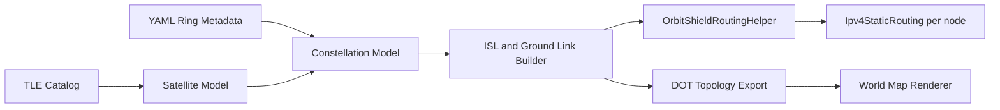
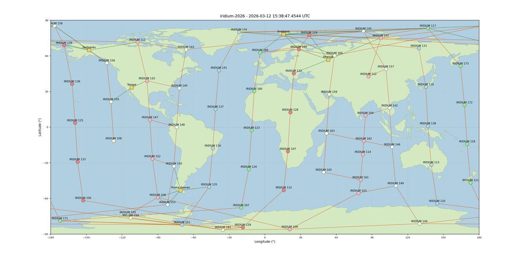

# OrbitShield Module

[](../../LICENSE)
[](../../README.md)

## Overview

OrbitShield is an ns-3 module to simulate satellite constellations, inter-satellite links (ISLs), and satellite-ground connectivity for LEO-style systems.

The module provides:
- Satellite nodes initialized from TLEs via SGP4 (through `perturb`)
- Constellation loading from TLE and YAML metadata files
- Ring-aware topology metadata and traversal helpers
- Ground station modeling
- Distance-based ISL and satellite-ground link construction
- Point-to-point `SatelliteNetDevice` with multi-link support
- Full IPv4 stack integration with sequential /30 subnet assignment
- Shortest-hop static route recomputation on each topology refresh
- Time-aware topology refresh with automatic route updates
- DOT export and visualization tooling

## Table of Contents

- [Overview](#overview)
- [Quick Start](#quick-start)
- [Architecture](#architecture)
- [Module Components](#module-components)
  - [Models and Core Components](#models-and-core-components)
  - [Tests](#tests)
  - [Examples](#examples)
  - [Experiments](#experiments)
  - [Tools](#tools)
- [Module Structure](#module-structure)
- [Dependencies](#dependencies)
- [Prerequisites](#prerequisites)
- [Compatibility](#compatibility)
- [Building](#building)
- [Basic Usage](#basic-usage)
  - [Create One Satellite from TLE](#create-one-satellite-from-tle)
  - [Create Constellation from TLE File](#create-constellation-from-tle-file)
  - [Create Constellation from YAML Ring File](#create-constellation-from-yaml-ring-file)
  - [Build Links](#build-links)
  - [Dynamic Refresh](#dynamic-refresh)
  - [Install Routing](#install-routing)
- [Ring Metadata Format (YAML)](#ring-metadata-format-yaml)
- [Network Routing](#network-routing)
  - [IPv4 Stack Installation](#ipv4-stack-installation)
  - [Route Recomputation Algorithm](#route-recomputation-algorithm)
  - [Dynamic Refresh Integration](#dynamic-refresh-integration)
  - [SatelliteNetDevice Trait Summary](#satellitenetdevice-trait-summary)
  - [Known Constraints](#known-constraints)
- [Targeted Flow Grayhole Experiment](#targeted-flow-grayhole-experiment)
  - [Profile Format](#profile-format)
  - [Telemetry Artifacts](#telemetry-artifacts)
  - [Detector and Mitigation](#detector-and-mitigation)
- [Visualization Tooling](#visualization-tooling)
  - [ISL Visualizer](#isl-visualizer-orbitshield-isl-visualizer)
  - [Render DOT on World Map](#render-dot-on-world-map)
  - [Generate Frames / GIF](#generate-frames--gif)
  - [Example Generated Visualization](#example-generated-visualization)
- [Running Examples](#running-examples)
- [API Reference](#api-reference)
- [Testing](#testing)
- [Coordinate System Notes](#coordinate-system-notes)
- [Future Enhancements](#future-enhancements)
- [Contributing](#contributing)
- [Citation and Attribution](#citation-and-attribution)
- [Release Notes](#release-notes)
- [License](#license)
- [Authors](#authors)

## Quick Start

From the ns-3 root:

```bash
./ns3 configure --enable-tests --enable-examples
./ns3 build
./ns3 run "test-runner --suite=orbitshield"
```

To generate and visualize a constellation topology:

```bash
./ns3 run orbitshield-isl-visualizer -- \
  --ringFile=contrib/orbitshield/data/iridium-20260312.yaml \
  --islMaxRange=5000 \
  --groundMaxRange=3000 \
  --simTime=600 \
  --outputFile=out.dot

./contrib/orbitshield/tools/generate-constellation-image.sh --frames=10 --timeStep=60 --gifFile=iridium.gif --gifFps=10
```

## Architecture


```mermaid
flowchart LR
    TLE[TLE Catalog] --> SAT[Satellite Model]
    YAML[YAML Ring Metadata] --> CONST[Constellation Model]
    SAT --> CONST
    CONST --> ISL[ISL and Ground Link Builder]
    ISL --> ROUTE[OrbitShieldRoutingHelper]
    ROUTE --> IPV4[Ipv4StaticRouting per node]
    ISL --> DOT[DOT Topology Export]
    DOT --> MAP[World Map Renderer]
```

## Module Components

### Models and Core Components

- `Satellite` (`Node`):
  - TLE-backed orbital propagation via SGP4
  - Position in **ECEF** coordinates (`GetPosition`)
  - Velocity in **ECI/TEME** coordinates (`GetVelocity`)
  - Ground track latitude/longitude/altitude
- `GroundStation` (`Node`):
  - Name, latitude, longitude
  - Fixed-position mobility attachment for link-distance evaluation
- `Constellation` (`Object`):
  - Load from TLE text files or YAML ring metadata (with optional auto-load of TLE file)
  - Ring APIs: `GetSatellitesInRing`, `GetNextRingSatellites`, `GetPreviousRingSatellites`, `GetRingOfSatellite`
  - Ground station access: `GetGroundStations`
  - ISL creation (`CreateIslLinks`) and satellite-ground link creation (`CreateGroundLinks`)
  - Cached current topology: `GetCurrentIsls`, `GetCurrentGroundLinks`
  - Periodic topology refresh: `SetIslRefreshInterval`, `RefreshIslTopology`
  - Route-update callback hook: `SetRouteUpdateCallback`
  - Graphviz DOT export for satellites, ground stations, and links
- `SatelliteNetDevice` (`NetDevice`):
  - Point-to-point device for ISL and satellite-ground channels
  - Multi-link support: manages a vector of `SatelliteLink` objects per device
  - Correct P2P trait methods: `IsPointToPoint→true`, `NeedsArp→false`, `IsBroadcast→false`
  - Gateway-aware fanout selection for multi-link nodes during IPv4 forwarding
  - Optional grayhole forwarding policy hook for route-conditioned selective drops
- `SatelliteLink` (`Channel`):
  - Point-to-point satellite channel with configurable `IslPropagationDelayModel`
  - Range-based active/inactive state
- `SatelliteMobilityModel`:
  - Binds ns-3 mobility interface to a `Satellite` for distance-based calculations
- `IslPropagationDelayModel`:
  - Delay model based on Euclidean distance between endpoint mobility models
- `OrbitShieldRoutingHelper`:
  - Plain C++ helper (not an ns-3 Object)
  - `Install(Ptr<Constellation>)`: installs Internet stack, assigns sequential /30 subnets, registers refresh callback, computes initial routes
  - `RecomputeRoutes(Ptr<Constellation>)`: BFS shortest-hop route recomputation; clears and rebuilds `Ipv4StaticRouting` tables on all nodes
  - Route path introspection by source node and destination IPv4 address
  - Optional satellite exclusion set for mitigation route recomputation
- `OrbitShieldGrayholePolicy`:
  - Route-conditioned target-flow policy for compromised satellites
  - Matches IPv4 ground-pair traffic by configured direction and attack window
  - Emits forwarding decisions for accepted and dropped target packets
- `OrbitShieldUtils`:
  - Utility functions used across the module

### Tests

All tests are in the `orbitshield` suite and can be run with:

```bash
./ns3 run "test-runner --suite=orbitshield"
```

| Test case | What it covers |
|---|---|
| `SatelliteTestCase` | TLE-based satellite construction and propagation |
| `ConstellationTestCase` | Ring/YAML loading, ring traversal, DOT export |
| `IslChannelTestCase` | ISL channel send/receive, propagation delay behavior |
| `OrbitShieldIridiumTopologyTest` | Constellation load from YAML, ring and ground station discovery |
| `OrbitShieldRoutingHelperTest` | Routing helper API construction, Install/RecomputeRoutes calls |
| `OrbitShieldMultiLinkDeviceTest` | SatelliteNetDevice multi-link add/get/send semantics |
| `OrbitShieldGroundStationMultiLinkTest` | Ground station nodes with multiple concurrent satellite links |
| `OrbitShieldIpv4AddressAssignmentTest` | Sequential /30 subnet assignment (ISLs first, then GSLs) |
| `OrbitShieldRefreshSafeRoutingTest` | ICMP delivery across at least one topology refresh interval |
| `OrbitShieldTempeFairbanksPingPathTest` | End-to-end Tempe-Fairbanks ICMP ping over 60-second window; RTT ≤ 500 ms; ≥ 2 hops |
| `OrbitShieldDynamicRouteRefreshTest` | 10 route recomputations over 600 s; at least one reply in first 120 s |
| `OrbitShieldMultiGroundStationRoutingTest` | All 10 GS pairs over 300 s / 30 s refresh; ≥ 7 pairs ≥ 80% delivery; RTT ≤ 500 ms; hop count ≤ 8 |
| `OrbitShieldStaticRoutingStrategyTest` | Static recomputation under 20 fast refreshes (15 s) over 300 s; no crash |
| `OrbitShieldTargetedFlowGrayholeConfigTest` | Targeted-flow grayhole profile parsing, defaults, variants, invalid values, path resolution |
| `OrbitShieldRouteMembershipTest` | Current route path and satellite transit membership for a target ground-station pair |
| `OrbitShieldGrayholePolicyTest` | Route-active compromised satellite drops only target packets inside the attack window |
| `OrbitShieldTargetedFlowGrayholeTelemetryTest` | In-memory targeted-flow grayhole records and CSV artifact headers/data rows |
| `OrbitShieldRouteExclusionTest` | Excluded satellites are omitted from recomputed routes and stale routes are removed |
| `OrbitShieldTargetedFlowGrayholeDetectorTest` | Low-PDR target windows flag only satellites on target routes |
| `OrbitShieldTargetedFlowGrayholeExperimentTest` | Short deterministic targeted-flow grayhole runs with mitigation and no-mitigation variants |

### Examples

- `orbitshield-basic-example`
- `orbitshield-load-from-tle`
- `orbitshield-load-from-yaml`
- `orbitshield-dynamic-topology`

### Experiments

- `orbitshield-targeted-flow-grayhole` (`experiments/targeted-flow-grayhole/`): targeted ground-pair grayhole workflow built on generic OrbitShield models, route introspection, and route exclusion.

### Tools

- `orbitshield-isl-visualizer` (C++ executable)
- `render-isl-worldmap.py` (Python DOT-to-world-map renderer)
- `generate-constellation-image.sh` (end-to-end frame/image/GIF generation helper)
- `analyze_constellation_rings.py` (ring metadata diagnostics and sanity checks)
- `convert_tle_to_csv.py` (TLE conversion utility for downstream analysis)

## Module Structure

```text
contrib/orbitshield/
|- model/
|  |- satellite.h / satellite.cc
|  |- ground-station.h / ground-station.cc
|  |- constellation.h / constellation.cc
|  |- satellite-link.h / satellite-link.cc
|  |- satellite-net-device.h / satellite-net-device.cc
|  |- satellite-mobility-model.h / satellite-mobility-model.cc
|  |- isl-propagation-delay-model.h / isl-propagation-delay-model.cc
|  |- orbitshield-routing-helper.h / orbitshield-routing-helper.cc
|  |- orbitshield-grayhole-policy.h / orbitshield-grayhole-policy.cc
|  |- orbitshield-utils.h / orbitshield-utils.cc
|  |- orbitshield-module.h
|- experiments/
|  |- CMakeLists.txt
|  |- targeted-flow-grayhole/
|     |- CMakeLists.txt
|     |- README.md
|     |- targeted-flow-grayhole.cc
|     |- targeted-flow-grayhole-config.h / targeted-flow-grayhole-config.cc
|     |- targeted-flow-grayhole-detector.h / targeted-flow-grayhole-detector.cc
|     |- targeted-flow-grayhole-runner.h / targeted-flow-grayhole-runner.cc
|     |- targeted-flow-grayhole-telemetry.h / targeted-flow-grayhole-telemetry.cc
|     |- profiles/
|        |- targeted-flow-grayhole.yaml
|- test/
|  |- test-satellite.h / test-satellite.cc
|  |- test-constellation.h / test-constellation.cc
|  |- test-isl.h / test-isl.cc
|  |- test-routing.h / test-routing.cc
|  |- test-orbitshield.cc
|- examples/
|  |- orbitshield-basic-example.cc
|  |- orbitshield-load-from-tle.cc
|  |- orbitshield-load-from-yaml.cc
|  |- orbitshield-dynamic-topology.cc
|- tools/
|  |- .ne_110m_land.geojson
|  |- analyze_constellation_rings.py
|  |- convert_tle_to_csv.py
|  |- isl-visualizer.cc
|  |- render-isl-worldmap.py
|  |- generate-constellation-image.sh
|- data/
|  |- iridium-20260312.txt
|  |- iridium-20260312.yaml
|- CMakeLists.txt
`- README.md
```

## Dependencies

- `perturb` — SGP4 wrapper, fetched automatically by CMake (`FetchContent`)
- `yaml-cpp` — YAML constellation metadata parsing, fetched automatically by CMake (`FetchContent`)
- ns-3 modules linked by OrbitShield:
  - `core`, `network`, `mobility`, `propagation`, `buildings`
  - `internet` — for `InternetStackHelper`, `Ipv4`, `Ipv4StaticRouting`
  - `applications` — for `V4PingHelper` and related application helpers

## Prerequisites

- A working ns-3 build environment (compiler, CMake, Python)
- `graphviz` (`dot`) for DOT rendering
- Python 3 with `matplotlib` for world-map rendering

`yaml-cpp` and `perturb` are fetched automatically by CMake during configure/build.

Example install (Ubuntu/Debian):

```bash
sudo apt-get update
sudo apt-get install -y graphviz python3-matplotlib
```

## Compatibility

- Targeted for the ns-3 development tree in this repository.
- Designed for Linux-based development environments.
- If using a different ns-3 branch or toolchain, validate with a full build and test run.

## Building

From ns-3 root:

```bash
./ns3 configure --enable-tests --enable-examples
./ns3 build
```

## Basic Usage

### Create One Satellite from TLE

```cpp
#include "ns3/orbitshield-module.h"
using namespace ns3;

int main()
{
    std::string name = "ISS (ZARYA)";
    std::string tle1 = "1 25544U 98067A   22071.78032407  .00021395  00000-0  39008-3 0  9996";
    std::string tle2 = "2 25544  51.6424  94.0370 0004047 256.5103  89.8846 15.49386383330227";

    // perturb::Satellite::from_tle mutates its string arguments; use copies for epoch extraction.
    std::string tle1Epoch = tle1;
    std::string tle2Epoch = tle2;
    perturb::Satellite tmp = perturb::Satellite::from_tle(tle1Epoch, tle2Epoch);
    perturb::JulianDate simStart = tmp.epoch();

    Ptr<Satellite> sat = CreateObject<Satellite>(name, tle1, tle2, simStart);

    Vector3D ecef = sat->GetPosition();
    std::cout << sat->GetName() << " ECEF=" << ecef << std::endl;
    return 0;
}
```

### Create Constellation from TLE File

```cpp
Ptr<Constellation> constellation = CreateObject<Constellation>();
constellation->LoadFromTleFile("contrib/orbitshield/data/iridium-20260312.txt");

for (const auto& sat : constellation->GetSatellites())
{
    std::cout << sat->GetName() << " pos=" << sat->GetPosition() << "\n";
}
```

### Create Constellation from YAML Ring File

```cpp
Ptr<Constellation> constellation = CreateObject<Constellation>();
constellation->LoadFromRingFile("contrib/orbitshield/data/iridium-20260312.yaml");

std::cout << "Rings: " << constellation->GetRingCount() << "\n";
for (const auto& gs : constellation->GetGroundStations())
{
    std::cout << "GS " << gs->GetName()
              << " lat=" << gs->GetLatitude()
              << " lon=" << gs->GetLongitude() << "\n";
}
```

### Build Links

```cpp
double islRangeMeters    = 2'000'000.0;  // 2000 km
double groundRangeMeters = 3'000'000.0;  // 3000 km

auto isls        = constellation->CreateIslLinks(islRangeMeters);
auto groundLinks = constellation->CreateGroundLinks(groundRangeMeters);
```

### Dynamic Refresh

```cpp
constellation->SetIslRefreshInterval(Seconds(10));
constellation->CreateIslLinks(2'000'000.0);  // seeds cached range and schedules refresh

Simulator::Stop(Seconds(60));
Simulator::Run();

const auto& refreshed = constellation->GetCurrentIsls();
```

### Install Routing

```cpp
constellation->LoadFromRingFile("contrib/orbitshield/data/iridium-20260312.yaml");
constellation->CreateIslLinks(2'000'000.0);
constellation->CreateGroundLinks(3'000'000.0);
constellation->SetIslRefreshInterval(Seconds(30));

OrbitShieldRoutingHelper routingHelper;
routingHelper.Install(constellation);  // installs stack, assigns addresses, sets up routes

Simulator::Stop(Seconds(300));
Simulator::Run();
```

## Ring Metadata Format (YAML)

OrbitShield expects YAML ring metadata files of the following form:

```yaml
constellationName: iridium-2026
tleFile: iridium-20260312.txt          # optional; resolved relative to the YAML file
ringCount: 6
rings:
  - id: 0
    satellites:
      - IRIDIUM 113
      - IRIDIUM 116
groundStations:
  - name: Tempe
    latitude: 33.41
    longitude: -111.94
```

Notes:
- `tleFile` is optional; if present it is resolved relative to the YAML file path.
- `groundStations` is optional.
- The canonical test dataset is `data/iridium-20260312.yaml`, which defines the five Iridium ground stations used in routing tests: Tempe (AZ), Fairbanks (AK), Svalbard (NO), Izhevsk (RU), Punta Arenas (CL).

## Network Routing

### IPv4 Stack Installation

`OrbitShieldRoutingHelper::Install(Ptr<Constellation>)` performs the following steps:

1. Installs ns-3 `InternetStackHelper` on all satellite and ground station nodes.
2. Enables IPv4 forwarding (`Ipv4::IpForward = true`) on all satellite nodes.
3. Assigns sequential `/30` subnets to every link interface, starting at `10.0.0.0`:
   - ISL links are assigned first (in creation order), then GSL links continue from the next block.
   - Block `N` maps to network `10.0.0.0 + N×4`, yielding host addresses `.1` and `.2`.
   - `Ipv4AddressHelper::SetBase()` is called before each `Assign()` to prevent the ns-3 `NewAddress()` overflow assertion.
4. Registers a refresh callback with `Constellation::SetRouteUpdateCallback()`.
5. Performs an initial route recomputation immediately after interface setup.

### Route Recomputation Algorithm

`OrbitShieldRoutingHelper::RecomputeRoutes(Ptr<Constellation>)`:

1. Builds an adjacency list over all currently active ISL and GSL links, using matched /30 interface addresses to identify link endpoints and next-hop gateway addresses.
2. Clears all existing `Ipv4StaticRouting` entries on every node (prevents stale forwarding state after satellite motion).
3. For each source node, runs a BFS (shortest-hop, unit edge weight) over the adjacency list.
4. Installs `AddHostRouteTo` entries for every reachable destination address, selecting the correct next-hop gateway and outgoing interface index.

The helper also caches the last recomputed node path for each source/destination host route. `GetRoutePath()`, `GetRouteHopCount()`, and `GetTransitSatelliteNames()` expose this route membership for telemetry, target-flow policies, and detector inputs.

`SetExcludedSatellites()`, `AddExcludedSatellite()`, `ClearExcludedSatellites()`, and `GetExcludedSatellites()` configure satellites that should be treated as unavailable relays. During route recomputation, ISL and GSL edges incident to excluded satellites are skipped, and unreachable destinations do not retain stale host routes.

This strategy is robust for Iridium-class LEO constellations where refresh intervals are 15–60 seconds and the graph is dense enough that a full BFS pass completes well under 1 ms of simulation time.

### Dynamic Refresh Integration

`Constellation::RefreshIslTopology()` invokes the registered route-update callback at the end of each refresh cycle, after `m_currentIsls` and `m_currentGroundLinks` are rebuilt. This ensures:

- Stale static routes from the previous topology are cleared.
- New routes reflect the current set of active ISL and GSL links.
- No gap exists between topology change and route table update within the same simulation event.

### SatelliteNetDevice Trait Summary

| Method | Value | Rationale |
|---|---|---|
| `IsPointToPoint()` | `true` | ISL/GSL channels are unicast point-to-point |
| `IsBroadcast()` | `false` | No broadcast on point-to-point links |
| `NeedsArp()` | `false` | ARP not needed for P2P links |
| `IsMulticast()` | `false` | No multicast on point-to-point links |
| `SupportsSendFrom()` | `true` | Supports source address override |

Multi-link `Send()` selects the outgoing link by resolving the packet's IPv4 destination against the static routing table when the L2 destination is the broadcast address. Only the link whose peer holds the gateway address is used, preventing duplicate-reply storms.

### Known Constraints

- IPv4 addresses are assigned once during `Install()` and do not change during the simulation, even as ISL topology changes. Route tables are rebuilt from these fixed addresses on every refresh.
- Unreachable destinations (no active ISL/GSL path) are silently dropped; no ICMP unreachable is generated.
- IPv6 is not supported. All routing uses `Ipv4StaticRouting`.
- `AddLinkChangeCallback` stores the callback but link-state change events are not fired (the device is always considered up after construction).

## Targeted Flow Grayhole Experiment

`orbitshield-targeted-flow-grayhole` runs a route-conditioned grayhole experiment from a YAML profile. The default profile is [experiments/targeted-flow-grayhole/profiles/targeted-flow-grayhole.yaml](experiments/targeted-flow-grayhole/profiles/targeted-flow-grayhole.yaml) and uses the Iridium dataset with Tempe, Fairbanks, Svalbard, Izhevsk, and Punta Arenas ground stations.

The runner loads the constellation, builds ISLs and GSLs, installs shortest-hop IPv4 routes, resolves target route membership, applies the grayhole policy inputs, evaluates deterministic detector windows, optionally excludes flagged satellites, and writes telemetry artifacts. For a fixed profile, seed, and run, the output is deterministic.

```bash
./ns3 run orbitshield-targeted-flow-grayhole -- \
  --config=contrib/orbitshield/experiments/targeted-flow-grayhole/profiles/targeted-flow-grayhole.yaml \
  --durationSeconds=300 \
  --outputDir=contrib/orbitshield/results/targeted-flow-grayhole-smoke
```

Supported scalar overrides are `--durationSeconds`, `--refreshIntervalSeconds`, `--attackDropProbability`, `--mitigationEnabled=true|false`, and `--outputDir`.

### Profile Format

The profile contains these top-level maps:

| Section | Purpose |
|---|---|
| `constellation` | Ring/TLE metadata file, resolved relative to the profile path |
| `simulation` | Duration and ns-3 RNG seed/run values |
| `topology` | ISL/GSL range and refresh cadence |
| `traffic` | ICMP-style ground-station traffic matrix and packet parameters |
| `attack` | Compromised satellites, target ground pairs, direction, timing, and drop probability |
| `detection` | Deterministic detector thresholds and minimum sample count |
| `mitigation` | Route-exclusion enable flag, delay, and exclusion cap |
| `telemetry` | Output directory, route snapshot cadence, and CSV enable flag |

The default target pair is `Tempe -> Fairbanks`; matching is bidirectional unless `attack.direction` is set to `forward` or `reverse`. The default compromised set is `IRIDIUM 113`. Grayhole drops occur only when a compromised satellite is also on the current target route and the attack window is active.

### Telemetry Artifacts

When `telemetry.writeCsv` is true, the runner writes:

| File | Contents |
|---|---|
| `flow_samples.csv` | Flow window delivery counts, PDR, RTT, and attack-window labels |
| `route_snapshots.csv` | Target flow route membership snapshots |
| `forwarding_events.csv` | Grayhole forwarding decisions and drop reasons |
| `node_labels.csv` | Compromised and flagged node labels |
| `mitigation_events.csv` | Detector flag/exclusion and route recomputation actions |

The same record types are available in memory through `OrbitShieldTargetedFlowGrayholeTelemetry` for tests and future integrations.

### Detector and Mitigation

`OrbitShieldTargetedFlowGrayholeDetector` is deterministic and configurable. It scores satellites that appear on target routes when a target-flow window has enough samples and PDR below `detection.targetPdrThreshold`. A satellite is flagged when its score reaches `detection.scoreThreshold`, subject to `mitigation.maxExcludedSatellites`.

When mitigation is enabled, flagged satellites are added to `OrbitShieldRoutingHelper`'s exclusion set and routes are recomputed. The implementation represents the AI action-policy hook with deterministic scoring; it does not include a trained model or external inference runtime.

## Visualization Tooling

### ISL Visualizer (`orbitshield-isl-visualizer`)

Generates a DOT topology snapshot from a YAML ring file.

Parameters:
- `--ringFile=<path>`
- `--islMaxRange=<km>`
- `--groundMaxRange=<km>`
- `--simTime=<seconds>`
- `--outputFile=<path>` (optional; stdout if omitted)

Example:

```bash
./ns3 run orbitshield-isl-visualizer -- \
  --ringFile=contrib/orbitshield/data/iridium-20260312.yaml \
  --islMaxRange=5000 \
  --groundMaxRange=3000 \
  --simTime=600 \
  --outputFile=out.dot
```

The DOT output includes metadata comments (`orbitshield.constellation`, `orbitshield.utc`, `orbitshield.sim_time_s`) consumed by the world-map renderer.

### Render DOT on World Map

```bash
python3 contrib/orbitshield/tools/render-isl-worldmap.py out.dot out.png
```

### Generate Frames / GIF

```bash
./contrib/orbitshield/tools/generate-constellation-image.sh \
  --ringFile=contrib/orbitshield/data/iridium-20260312.yaml \
  --islMaxRange=5000 \
  --groundMaxRange=3000 \
  --frames=60 \
  --timeStep=60 \
  --gifFile=orbitshield.gif
```

### Example Generated Visualization

Input files:
- YAML metadata: [contrib/orbitshield/data/iridium-20260312.yaml](data/iridium-20260312.yaml)
- TLEs: [contrib/orbitshield/data/iridium-20260312.txt](data/iridium-20260312.txt)



Open the full GIF directly: [docs/media/iridium-20260312.gif](docs/media/iridium-20260312.gif)

## Running Examples

```bash
./ns3 configure --enable-examples
./ns3 build

./ns3 run orbitshield-basic-example
./ns3 run orbitshield-load-from-tle
./ns3 run orbitshield-load-from-yaml
./ns3 run orbitshield-dynamic-topology
./ns3 run orbitshield-targeted-flow-grayhole -- \
  --config=contrib/orbitshield/experiments/targeted-flow-grayhole/profiles/targeted-flow-grayhole.yaml \
  --durationSeconds=300 \
  --outputDir=contrib/orbitshield/results/targeted-flow-grayhole-smoke
```

## API Reference

All public headers are exposed via the convenience include `ns3/orbitshield-module.h`:

- [`model/satellite.h`](model/satellite.h) — `Satellite` node
- [`model/ground-station.h`](model/ground-station.h) — `GroundStation` node
- [`model/constellation.h`](model/constellation.h) — `Constellation` manager
- [`model/satellite-link.h`](model/satellite-link.h) — `SatelliteLink` channel
- [`model/satellite-net-device.h`](model/satellite-net-device.h) — `SatelliteNetDevice`
- [`model/satellite-mobility-model.h`](model/satellite-mobility-model.h) — mobility binding
- [`model/isl-propagation-delay-model.h`](model/isl-propagation-delay-model.h) — ISL delay model
- [`model/orbitshield-routing-helper.h`](model/orbitshield-routing-helper.h) — `OrbitShieldRoutingHelper`
- [`model/orbitshield-grayhole-policy.h`](model/orbitshield-grayhole-policy.h) — `OrbitShieldGrayholePolicy`

Experiment-local headers under [experiments/targeted-flow-grayhole](experiments/targeted-flow-grayhole) are compiled into that workflow and its tests; they are not exported by `ns3/orbitshield-module.h`.

Common entry points:

```cpp
// Load and build topology
Ptr<Constellation> c = CreateObject<Constellation>();
c->LoadFromRingFile("contrib/orbitshield/data/iridium-20260312.yaml");
c->CreateIslLinks(2e6);
c->CreateGroundLinks(3e6);
c->SetIslRefreshInterval(Seconds(30));

// Install routing
OrbitShieldRoutingHelper rh;
rh.Install(c);

// Access current links
const auto& isls = c->GetCurrentIsls();
const auto& gsl  = c->GetCurrentGroundLinks();

// DOT export
std::string dot = c->ExportIslAsDot(isls, true);
```

## Testing

Build tests and run the full suite:

```bash
./ns3 configure --enable-tests
./ns3 build
./ns3 run "test-runner --suite=orbitshield"
```

The ns-3 test runner in this workspace selects the OrbitShield suite as a unit; use verbose output to inspect individual test-case results:

```bash
./ns3 run "test-runner --suite=orbitshield --verbose"
```

See the [Tests](#tests) table above for the full list of test cases and what each verifies.

## Coordinate System Notes

- `Satellite::GetPosition()` returns **ECEF** coordinates (meters).
- `Satellite::GetVelocity()` returns **ECI/TEME** velocity from SGP4.
- Ground track conversion outputs geographic latitude/longitude/altitude (WGS84).

When combining position and velocity in calculations, ensure frame conversions are handled consistently.

## Future Enhancements

- More detailed RF/link budget modeling
- Advanced handover and routing behavior over evolving topology (e.g., reactive protocol support)
- Extended atmospheric/orbital perturbation modeling beyond current SGP4 flow
- IPv6 support

## Contributing

Contributions are welcome. Please:
1. Follow ns-3 coding standards.
2. Add or extend tests for behavior changes.
3. Update this README when API or tool behavior changes.
4. Validate with `./ns3 build` and `./ns3 run "test-runner --suite=orbitshield"`.

## Citation and Attribution

If OrbitShield contributes to published work, cite ns-3 and reference this module repository path.

## Release Notes

OrbitShield module evolution is tracked in commit history and repository release artifacts.
ns-3 project-wide changes are available at [../../CHANGES.md](../../CHANGES.md).

## License

OrbitShield is distributed under GNU GPL v2 (see top-level ns-3 licensing files).

## Authors

Developed by Marco A. F. Barbosa.
